# Tutorial EBGeo

## Página Principal

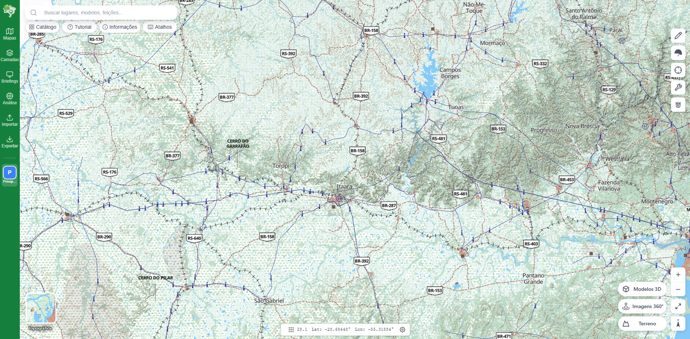

Na página principal, o tutorial será segmentado em módulos.

* Módulo 1: ferramentas gerais
* Módulo 2: painel lateral esquerdo
* Módulo 3: barra de busca
* Módulo 4: painel lateral superior direito de desenho
* Módulo 5: painel lateral inferior direito de ferramentas auxiliares
* Módulo 6: painel inferior de coordenadas
* Módulo 7: uso do Streetview
* Módulo 8: uso de ferramentas no mapeamento 3D
* Módulo 9: briefings (apresentações)
* Módulo 10: processamento e recursos avançados
* Módulo 11: linha do tempo (controle temporal)

### Módulo 1: Ferramentas Gerais

É possível navegar pelo mapa da seguintes formas no computador (nenhuma ferramenta selecionada):

- Botão esquerdo do mouse: ao pressionar e arrastar é possível mover o mapa.
- Ctrl+Botão esquerdo do mouse: ao pressionar e arrastar segurando Ctrl é possível rotacionar e inclinar o mapa.
- Botão direito do mouse: abre as opções de copiar coordenadas e orientar para o norte.
- Botão do meio do mouse: ao rolar o botão do meio do mouse, é possível mudar o zoom do mapa.
- Ctrl+C: Copiar os itens selecionados. É possível selecionar feições, textos e imagens.
- Ctrl+V: Colar as itens copiados.
- Ctrl+Z: Desfazer.
- Ctrl+Y: Refazer.
- Delete (ou Backspace): apaga as feições selecionadas (pede confirmação).
- Esc: cancela a seleção atual e desativa a ferramenta em uso.

#### Seleção de feições

- Clique simples seleciona uma feição.
- Shift+clique adiciona uma feição à seleção; Shift+clique novamente sobre uma feição já selecionada a remove da seleção (alterna).
- Atalho "Q" ativa a seleção por retângulo: arraste uma caixa para selecionar tudo dentro dela.
- Selecionar um grupo seleciona todas as suas feições de uma vez.
- Copiar e colar (Ctrl+C / Ctrl+V) leva junto as imagens associadas e funciona inclusive entre mapas diferentes. A cópia colada aparece com um pequeno deslocamento para facilitar a identificação.

#### Atração (atalho "G")

Ao desenhar, o cursor "gruda" automaticamente em vértices, arestas e extremidades de feições já existentes, facilitando o encaixe preciso. Um indicador visual aparece quando o ponto é capturado. Pressione "G" para ligar ou desligar a atração. Funciona nas ferramentas de desenho (ponto, linha, polígono, retângulo, círculo, elipse, setor) e nas ferramentas militares e de análise; segure Ctrl para inverter temporariamente o estado atual.

#### Edição de vértices

Após criar uma feição com vértices (linha, polígono, elipse, seta, etc.), selecione-a para editar: arraste um vértice para movê-lo, clique no ponto intermediário (no meio de cada segmento) para inserir um novo vértice, e use o botão direito sobre um vértice para removê-lo.

#### Seletor de mapa base

No canto inferior esquerdo há um seletor de mapa de fundo. Clique para expandir e escolher entre as opções disponíveis (carta topográfica, ortoimagem e BDGEx, entre outras). A escolha vale só para a sua tela: ela não muda o mapa base dos outros usuários do atlas, e por isso fica disponível também para quem só tem leitura e em mapa travado. Para definir o mapa base que o mapa mostra a quem chega, use **Salvar Posição** no menu do mapa.

### Módulo 2: Painel Lateral Esquerdo

<table>
  <tr>
    <td style="vertical-align: top; width: 15%;">
      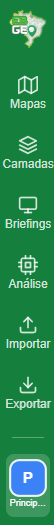
    </td>
    <td style="vertical-align: top;">
      <ul>
        <li><strong>Mapas:</strong> ficam centralizadas as opções de importação.</li>
        <li><strong>Camadas:</strong> onde ficam armazenados as camadas.</li>
        <li><strong>Briefings:</strong> onde ficam as apresentações (story maps).</li>
        <li><strong>Análise:</strong> onde ficam ferramentas para análises geoespaciais.</li>
        <li><strong>Importar:</strong> onde é possível importar arquivos.</li>
        <li><strong>Exportar:</strong> onde é possível exportar produtos finais.</li>
        <li>Uma aba de acesso rápido, que permite ciclar entre os mapas.</li>
      </ul>
    </td>
  </tr>
</table>

#### Mapas

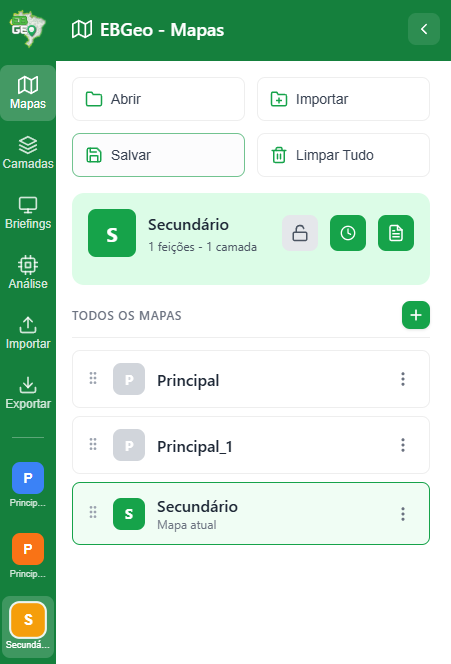

- Abrir: importar um arquivo .ebgeo, nesse caso, todos os mapas já desenhados são substituídos pelos novos mapas importados no .ebgeo.
- Importar: adicionar um arquivo .ebgeo aos mapas já existentes, nesse caso, são criados novos mapas em adição aos já existentes.
- Salvar: permite escolher quais mapas serão salvos no formato .ebgeo.
- Limpar Tudo: deleta todas as informações armazenadas no navegador, não é possível recuperar.

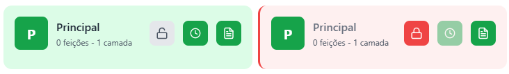

- É possível adicionar notas a um mapa, com título e informações relevantes que ficam armazenadas no .ebgeo.
- É possível travar o mapa, impedindo a realização de alterações.
- É possível ativar o controle temporal do mapa, pelo ícone de relógio (veja abaixo).

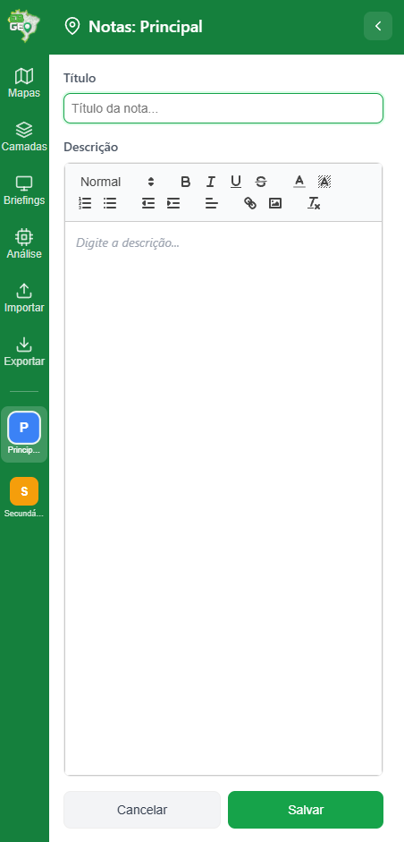

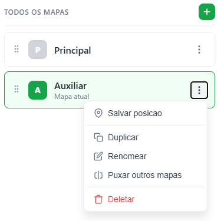

- Salvar Posição: salva a vista atual do mapa, que são três coisas: a posição, o mapa base que está na tela e se o controle temporal está ligado. Quando o arquivo .ebgeo for aberto em outra máquina ou o mapa for selecionado no painel, o mapa vai para a posição salva, com o mapa base e o controle temporal salvos. Em atlas compartilhado, é este o gesto que define o que os outros usuários veem ao entrar no mapa.
- Limpar posição salva: remove a vista salva do mapa inteira, ou seja, a posição, o mapa base e o estado do controle temporal salvos com ela. O que está na sua tela não muda; o que muda é o que encontra quem entrar no mapa depois.
- Duplicar: duplicar o mapa atual, para edição em outro mapa com as informações do mapa anterior.
- Renomear: alterar o nome do mapa atual.
- Puxar outros mapas: puxa as camadas de outro mapa para o mapa atual, permitindo a mescla de dois mapas distintos.
- Reordenar: arraste os mapas na lista para mudar a ordem.
- Excluir: exclui o mapa atual.

##### Compartilhar o atlas

Quem tem Gestão no atlas vê **Compartilhar** na aba Mapas e no menu da conta (e no cartão do atlas, na página dos seus atlas). O painel reúne o link público, os membros, os grupos e a busca de pessoas, e **nada é gravado enquanto você mexe nele**:

- escolher alguém na busca põe a pessoa na lista como **Leitura**, marcada "Será adicionado ao aplicar"; trocar o nível de alguém mostra "Era Leitura; muda ao aplicar"; o X marca a linha "Será removido ao aplicar", com **Desfazer** ao lado. Grupos e o link público seguem a mesma regra;
- o rodapé conta as mudanças pendentes e tem **Cancelar** e **Aplicar**. **Aplicar** grava tudo de uma vez, primeiro o que tira acesso e por último o que dá. Tirar um grupo pede confirmação na hora de aplicar, dizendo quantas pessoas perdem o acesso;
- se uma mudança for recusada pelo servidor, ela continua na lista com o motivo ("Não aplicado: ..."), e as outras são gravadas normalmente. Corrija, desfaça ou clique **Aplicar** de novo;
- **Cancelar** descarta tudo e fecha. Fechar pelo X, pela tecla Esc ou clicando fora, com mudança pendente, pergunta antes se é para descartar;
- **Tornar dono** continua sendo um ato à parte, com confirmação própria, e só funciona sem mudança pendente.

##### Controle temporal do mapa

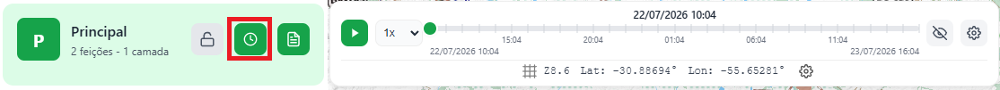

O ícone de **relógio** no card do mapa ativa e desativa o controle temporal daquele mapa na sua tela (os outros usuários do atlas não são afetados): com ele ativo, apenas as feições válidas no instante selecionado ficam visíveis, e a **barra de linha do tempo** aparece na parte inferior da tela. A **engrenagem** da barra abre as configurações temporais.

Consulte o Módulo 11 para o passo a passo completo (validade das feições, trajetórias e configurações temporais).

#### Camadas

Na aba de Camadas, ficam localizadas a análise do terreno (opção de visualizar ou não o sombreamento do terreno) e as feições criadas: pontos, linhas, polígonos, imagens, círculo, etc. Na hierarquia, um mapa pode ter diversas camadas e cada camada pode ter diversas feições, sejam elas repetidas ou não.

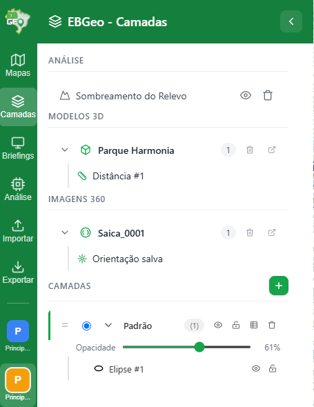

A camada que está selecionada é onde as feições criadas no mapa são criadas. Caso a feição seja criada na camada errada, basta clicar com o botão direito na feição dentro da tela do mapa e selecionar para mover de camada.

Dentro das opções de cada camada é possível marcar para que as feições daquela camada sejam vistas ou não, é possível travar aquele conjunto de camadas, não permitindo a seleção e a edição, é possível consultar a tabela de atributos daquela camada (é uma tabela de atributos compartilhada entre todas as feições daquela camada).

O bloqueio de edição/visualização pode ser feito tanto na camada inteira, quanto individualmente por feição.

Cada feição tem, na sua linha dentro da camada, um olho (ocultar/mostrar) e um cadeado (bloquear/desbloquear). É por eles que se mostra de novo uma feição oculta e se desbloqueia uma feição bloqueada depois que ela sai da seleção: a feição oculta não aparece no mapa e não responde ao clique, e a bloqueada não pode ser selecionada, movida nem editada pelo mapa.

As camadas podem ser reordenadas arrastando-as na lista, e as feições podem ser organizadas em grupos (expansíveis e recolhíveis). Os produtos do Catálogo (Modelos 3D, Imagens 360° e camadas de análise) também aparecem integrados nessa árvore.

As camadas adicionadas pelo Catálogo ficam agrupadas por categoria, nas seções Análise, Ortoimagem, Externa e Dados. Cada linha tem os botões de enquadrar, de ligar e desligar e de remover, e as camadas raster e de dados têm também o botão "Configurar estilo". A transparência de uma ortoimagem se ajusta só por esse botão, no controle Opacidade do painel de estilo, e a linha da camada não tem régua própria.

A opção de excluir exclui todas as feições daquela camada, sem possibilidade de recuperação.

##### Tabela de atributos

A tabela de atributos da camada permite buscar feições por texto, filtrar por tipo de feição (pontos, linhas, etc.), exibir apenas as feições selecionadas no mapa e editar atributos personalizados diretamente nas células. Clicar com o botão direito no cabeçalho de uma coluna de atributo personalizado abre a opção de remover esse atributo de todas as feições da camada.

#### Briefings

A aba Briefings reúne as apresentações (story maps) do projeto. Cada briefing é uma sequência de slides, e cada slide guarda uma posição de mapa (2D, 3D ou 360°) e um texto explicativo. Consulte o Módulo 9 para o passo a passo de criação e apresentação.

#### Importar

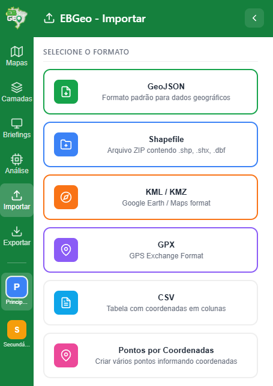

É possível importar dados geoespaciais de outras fontes para dentro do EBGeo: GeoJSON, Shapefile, KML/KMZ, GPX, CSV e Pontos por Coordenadas.

No caso de arquivos CSV (planilhas de coordenadas), o EBGeo detecta o separador automaticamente e permite escolher o formato das coordenadas (Lat/Long em grau decimal, Lat/Long em GMS, MGRS ou UTM) e mapear as demais colunas como atributos das feições.

Também é possível importar simplesmente arrastando o arquivo e soltando sobre a tela do mapa.

Existe um limitador da quantidade de feições que podem ser importadas de uma única vez. Caso a mensagem indique que foi excedido o limite de feições, sugere-se dividir o arquivo que se deseja carregar em mais partes.

**Dados com tempo.** Os arquivos importados podem trazer a dimensão temporal junto, e ela entra direto na linha do tempo do mapa (Módulo 11). O que o EBGeo lê, por tipo de arquivo:

- **CSV**: no painel de configuração do CSV, abaixo das colunas de coordenadas, existem os seletores **Coluna de início** e **Coluna de fim**. A coluna escolhida vira a validade temporal de cada feição. São aceitas a data brasileira dd/mm/aaaa, com hora opcional (dd/mm/aaaa hh:mm ou hh:mm:ss), a data ISO 8601 aaaa-mm-dd e a data e hora ISO completa (aaaa-mm-ddThh:mm), com ou sem fuso indicado, o GDH militar de seis dígitos mais mês e ano (por exemplo 010830MAR24, sempre em Zulu) e o número puro de milissegundos. Uma célula que o leitor não conseguir interpretar não vira janela de validade, mas o texto original é preservado como atributo comum da feição e um aviso diz quantas linhas ficaram nessa situação. Uma janela invertida (fim antes do início) perde o fim e entra no mesmo aviso, em vez de ser corrigida por conta própria.
- **GeoJSON, KML e KMZ**: aqui não há seletor de coluna. As datas são reconhecidas pelo **nome do atributo**, sem acento e sem diferenciar maiúsculas de minúsculas: inicio, data_inicio, temporalInicio, begin, start e start_time marcam o começo; fim, data_fim, temporalFim, end e end_time marcam o término. Um atributo de instante isolado (when, timestamp, datetime, date, time) preenche só o começo, e a feição passa a valer daquele momento em diante. Os formatos de data aceitos são os mesmos do CSV. Do KML também são lidos os marcadores de tempo do próprio formato: o intervalo (TimeSpan) vira começo e término, e o instante (TimeStamp) cai na regra acima.
- **GPX e KML cronometrados**: aqui a mudança é maior e é a que mais surpreende. Um trajeto que traga a hora de cada ponto (uma trilha gravada por GPS, um trajeto cronometrado do Google Earth) **deixa de ser uma linha e vira um ponto móvel**: uma única feição de ponto, posicionada no primeiro registro, carregando a trajetória inteira e a validade do primeiro ao último instante. Com o controle temporal ligado, ela percorre o caminho durante a reprodução, em vez de ficar desenhada como um traço parado. Pontos registrados com intervalo menor que um minuto são reduzidos a um por minuto, que é a menor divisão da linha do tempo. Trajetos **sem** hora continuam sendo importados como linha, como sempre foram.

<video src="./images/Importar.mp4" controls width="60%"></video>

#### Exportar

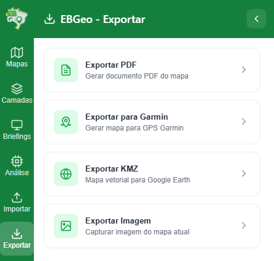

Além da exportação no formato .ebgeo, que permite compartilhar os mapas com outros usuários, é possível também exportar produtos finais.

- Exportar PDF: é possível exportar um arquivo .pdf com todas as feições criadas, o tamanho da folha é padrão (A4) mas a escala é configurável (de 1:1.000 a 1:5.000.000). É possível escolher a qualidade (DPI 150/200/300), a orientação e os elementos cartográficos exibidos (título, legenda, barra de escala, seta norte, grade Lat/Long e grade UTM), com pré-visualização no mapa. Além disso, o .pdf gerado já é georreferenciado, o que permite sua utilização em aplicativos como o Avenza Maps.
- Exportar Garmin: gera um mapa raster compatível com GPS Garmin de mão. Defina a área desejada com dois cliques no mapa.
- Exportar KMZ: gera um mapa como KMZ vetorial para Google Earth, preservando estilo, imagens e atributos. As fotos anexadas aparecem no balão de cada feição.
- Exportar imagem: tira uma captura de tela do EBGeo e salva no formato de imagem, é ideal para ser utilizado em apresentações de slides. Quando os visualizadores 3D ou 360° estão abertos, a captura é feita da cena correspondente.

<video src="./images/Exportar.mp4" controls width="60%"></video>

> A exportação para QAN (Quadro Auxiliar de Navegação) de linhas e polígonos fica no botão "Exportar QAN", na aba Azimutes do painel da feição.

### Módulo 3: Barra de Busca

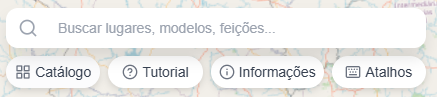

A pesquisa é realizada nos seguintes dados: quaisquer nomes presentes no mapa (cidades, serras, morros, nomes locais, rios, massas d'água), modelos 3D existentes, modelos Streetview, feições já criadas no mapa e coordenadas.

A busca por coordenadas detecta automaticamente vários formatos: Lat/Long em graus decimais, GMS (graus, minutos e segundos), MGRS e UTM. Os resultados aparecem no painel lateral, marcados temporariamente no mapa, e podem ser salvos como feição.

<video src="./images/Buscar.mp4" controls width="60%"></video>

#### Catálogo

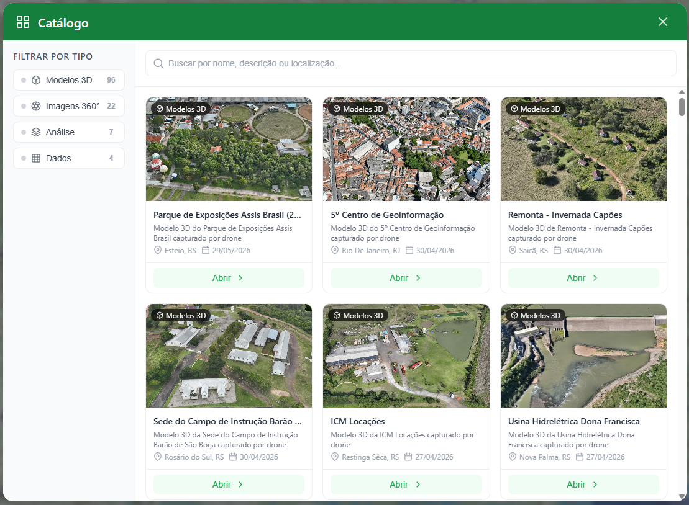

No botão Catálogo (abaixo da barra de busca), o operador pode verificar quais produtos especiais foram construídos, dentre eles: Modelos 3D, Imagens 360° (Streetview), Camadas de Análise (ex.: declividade, trafegabilidade) e Dados das cartas prontas nas diversas escalas. É possível filtrar por categoria, pesquisar pelo nome e, ao clicar em um item, ele é aberto: modelos 3D abrem no visualizador 3D, imagens 360° no visualizador panorâmico, e camadas de análise/dados são adicionadas ao mapa (com enquadramento automático quando a camada possui limites definidos).

A categoria **Ortoimagem** reúne as ortoimagens de drone, fotos aéreas retificadas de uma área levantada num voo. O cartão mostra o nome, a data do voo, o local, a descrição e a miniatura, e o filtro Ortoimagem do Catálogo mostra só essa categoria. Ao abrir o cartão, a ortoimagem entra no mapa enquadrada pelos limites dela e aparece na seção Ortoimagem da aba de camadas. No mapa ela fica logo acima do mapa base e abaixo do sombreamento e das camadas de análise, porque a foto é opaca e cobriria a declividade ou a trafegabilidade se ficasse por cima delas. Uma ortoimagem pode ser pública ou de acesso restrito, como as camadas de análise: a restrita só aparece para quem recebeu acesso a ela, por concessão ou por empréstimo do atlas aberto. Quem administra o atlas pode desligar a categoria inteira ou escolher quais ortoimagens o atlas oferece, na aba Catálogo das configurações do atlas.

O cadastro da ortoimagem é feito pelo administrador ou pelo produtor da OM dona, no painel de administração, aba Catálogo, sub-aba Ortoimagem. O formulário pede o identificador, o nome, a descrição, a OM dona, a visibilidade e a miniatura, e no bloco de configuração a opacidade inicial, se a camada nasce visível, os limites (oeste, sul, leste e norte), a data do voo, o local, a resolução em centímetros e o equipamento (os dois últimos opcionais), além da fonte de tiles em JSON (o endereço do arquivo publicado no servidor de tiles, com o zoom mínimo e o máximo da pirâmide do arquivo), da pintura e da legenda. A ortoimagem não tem vídeo de prévia, só a miniatura.

Num item **privado**, quem pode repassá-lo vê **Compartilhar** no cartão (no mapa base privado, o mesmo botão fica no seletor de mapa base). Ele abre o diálogo **Conceder acesso**, o mesmo da aba Concessões da administração, já com o recurso escolhido: busque pessoas ou grupos (eles vão para uma lista, sem conceder nada), escolha o nível e o prazo, e só **Conceder** grava. **Cancelar** fecha sem gravar; fechar pelo X ou pela tecla Esc com alguém na lista pergunta antes. Para ver, estender ou remover o que você já concedeu, use a aba **Concessões**, cujo link aparece no próprio diálogo.

A categoria **Externa** reúne camadas servidas por terceiros fora da rede, como as imagens de satélite meteorológico, e aparece no Catálogo de todo atlas, a menos que quem administra o atlas a desligue nas configurações dele. Nenhuma camada externa é desenhada sozinha: ela só entra no mapa, e na seção Externa da aba de camadas, quando você a adiciona pelo Catálogo, e a partir daí cada tile informa ao terceiro a região e o instante consultados.

#### Tutorial

No botão Tutorial (abaixo da barra de busca), o operador é redirecionado para esse link, onde é possível verificar quais funções estão disponíveis e acessar um breve guia sobre cada ferramenta.

#### Informações

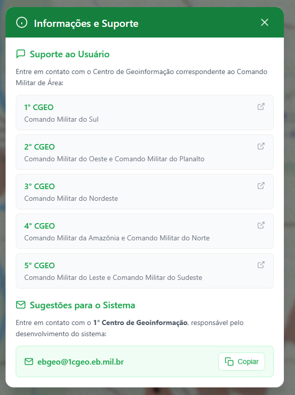

Lista de contatos úteis para retirada de dúvidas, sugestão de melhorias e comunicação de eventuais falhas no sistema.

#### Atalhos

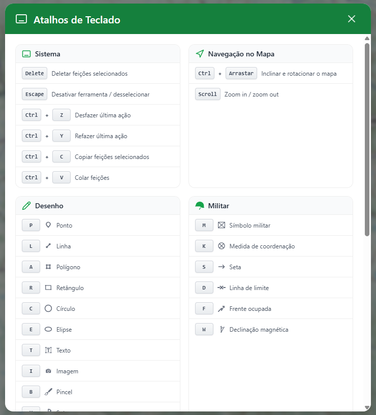

A maioria das ferramentas de desenho do EBGeo possuem atalhos no teclado para melhorar a usabilidade da plataforma. A tabela abaixo lista todos os atalhos disponíveis:

| Tecla | Ferramenta / Ação |
| --- | --- |
| P | Ponto |
| L | Linha |
| A | Área (polígono) (Desenho) e Medir Área (Visualizador 3D) |
| R | Retângulo |
| C | Círculo |
| E | Elipse |
| U | Setor |
| T | Texto |
| I | Imagem |
| B | Pincel |
| M | Simbologia Militar (Militar) e Adicionar marcador (Visualizador 3D) |
| K | Medida de Coordenação |
| S | Seta |
| D | Linha de Limite (Militar) e Medir distância (Visualizador 3D) |
| Y | Linha de Coordenação |
| F | Frente Ocupada |
| W | Declinação Magnética |
| Z | Azimute e Distância |
| O | Linha de Visada (LOS), se o atlas tiver terreno |
| V | Visibilidade / Viewshed, se o atlas tiver terreno |
| J | Medir Distância |
| H | Medir Área |
| X | Medir Ângulo |
| G | Ligar/desligar atração |
| Q | Seleção por retângulo |
| N | Informação de vetor (mapa base) |
| Ctrl+Z / Ctrl+Y | Desfazer / Refazer |
| Ctrl+C / Ctrl+V | Copiar / Colar |
| Delete / Backspace | Excluir seleção |
| Esc | Cancelar seleção / desativar ferramenta |
| Ctrl + Arrastar | Inclinar e rotacionar o mapa|
| Scroll | Zoom in / Zoom out |

### Módulo 4: Painel de Desenho

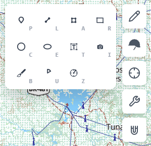

Antes de avançarmos nas ferramentas individuais de desenhos, devemos verificar o painel associado as camadas de desenho.

- Em "Ponto #1" é possível alterar o nome daquela feição
- Ao lado do nome, antes da engrenagem, ficam o olho e o cadeado, os mesmos da aba de Camadas: o olho oculta a feição selecionada (ou todas as selecionadas) e o cadeado a bloqueia. A seleção continua, então o mesmo botão desfaz o clique; enquanto ela estiver bloqueada, o painel fica só para leitura e a feição não pode ser arrastada nem ter os vértices editados. Depois de desmarcada, a feição oculta ou bloqueada volta pelo olho ou pelo cadeado da linha dela na aba de Camadas.
- Em + Adicionar descrição é possível inserir um texto com informações daquela feição, esse texto não aparece no mapa e fica associado a cada feição criada, sem ser um atributo.
- É possível associar fotos e imagens a cada feição criada
- Cada feição e seus tipos tem suas próprias características de estilos, para ponto: alterar o tamanho e a opacidade, mas para linha, tem a possibilidade de alterar a espessura e o padrão da linha. Cada tipo de feição, nesse mesmo painel, recebe a sua possibilidade de estilização.
- Além do estilo, é possível criar atributos que ficam associados a feição e aquele conjunto de camadas. Os atributos abrem pelo ícone ao lado do olho e do cadeado, no alto do painel, que mostra quantos a feição tem; "Voltar" traz o estilo de volta. O que se muda ali grava na hora, sem "Salvar".
- A ferramenta "Definir como padrão" faz com que os próximos desenhos daquele tipo de feição recebem as mesmas características da feição atualmente criada. Para linhas por exemplo: definida uma cor, um padrão de desenho e uma espessura, a próxima linha seguirá o mesmo aspecto.

#### Recursos de estilo comuns

Estes recursos aparecem em várias ferramentas:

- **Padrão de linha**: linhas e bordas podem ser sólidas, tracejadas, pontilhadas ou traço-ponto.
- **Hachura**: o preenchimento de polígonos, círculos, elipses, retângulos e setores pode receber hachuras (horizontal, vertical, diagonal nos dois sentidos, cruzada em + ou em X, ou pontos), com espaçamento e espessura ajustáveis.
- **Correção de zoom**: pontos, textos, imagens, pincel e símbolos militares podem manter o tamanho visual constante independentemente do zoom (ligando a correção de zoom).
- **Etiqueta (label)**: várias feições permitem exibir um texto no mapa, com cor, contorno e tamanho próprios.
- **Medição automática**: o painel exibe o comprimento (linhas) ou a área (formas fechadas) calculados.

#### Desenhos Básicos

Em geral, feições que são possíveis adquirir mais de um vértice, os vértices são adquiridos clicando com o botão esquerdo do _mouse_ e a edição finaliza com o botão direito. Enquanto feições que só tem um ponto inicial e um final, os pontos são adquiridos clicando com o botão esquerdo do _mouse_ e a edição finaliza com o botão esquerdo.

##### Ponto (Atalho "P"), Linha (Atalho "L") e Área (Atalho "A")

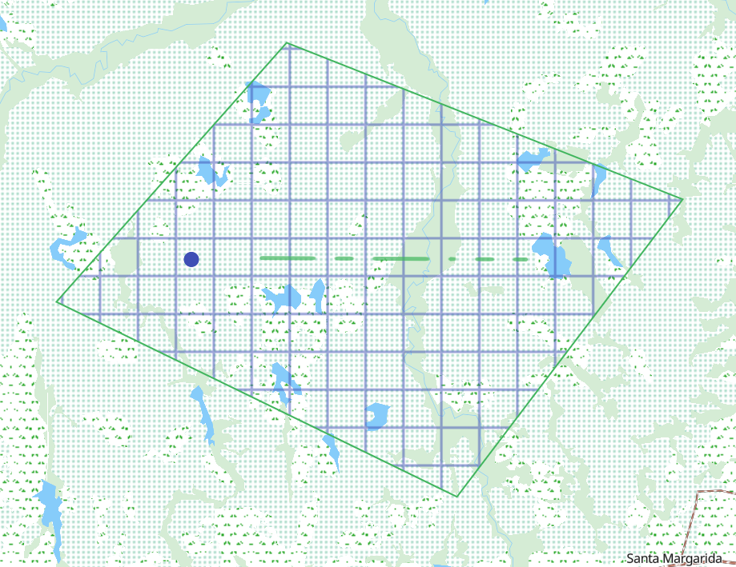

- **Ponto**: pode ser exibido como **marcador** (escolha o símbolo entre as formas círculo, quadrado, losango, triângulo, estrela, cruz ou X, os ícones prontos — veículo, drone, incêndio, armamento, comunicações, aeronave e suprimento — ou um ícone personalizado carregado por você; cor, borda, tamanho e opacidade) ou como **etiqueta** (um texto fixado no mapa; o botão "Preencher com coordenadas" insere a posição automaticamente).
- **Linha**: além de cor, espessura e padrão, pode exibir a **medição** (comprimento total) e o **perfil do terreno** (gráfico de elevação ao longo da linha, quando o atlas tem terreno; não precisa ligar o Terreno).
- **Área (polígono)**: preenchimento e borda configuráveis, hachura e exibição da área calculada.

<video src="./images/Pontos.mp4" controls width="49%"></video>
<video src="./images/Linhas.mp4" controls width="49%"></video>
<video src="./images/Poligono.mp4" controls width="49%"></video>

##### Retângulo (Atalho "R"), Círculo (Atalho "C"), Elipse (Atalho "E") e Setor (Atalho "U")

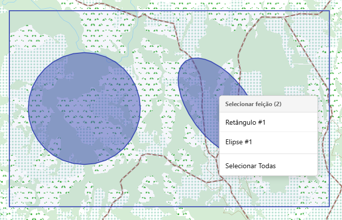

- **Retângulo**: criado com dois cliques (cantos opostos). Permite arredondar os cantos e rotacionar.
- **Círculo**: dois cliques (centro e raio). O raio pode ser ajustado numericamente em metros.
- **Elipse**: definida pelos eixos maior e menor, com rotação ajustável.
- **Setor**: cria um setor angular a partir de um centro, com raio e ângulo de abertura (1° a 359°, padrão 60°). Útil para representar setores de fogo, de vigilância ou de visada.

Todas suportam preenchimento, borda (com padrão de linha), hachura, etiqueta e cálculo de área.

Caso existam feições sobrepostas e elas não estejam travadas no Painel de Camadas, ao selecionar, irá aparecer um painel perguntando qual feição deseja ser editada.

##### Texto (Atalho "T"), Imagem (Atalho "I") e Pincel (Atalho "B")

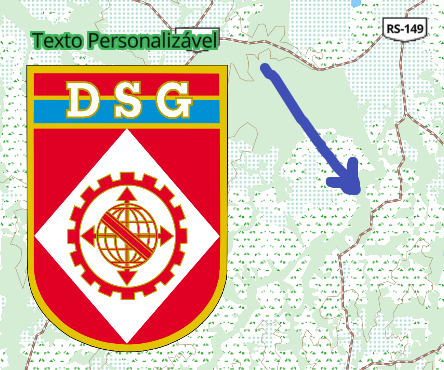

- **Texto**: posicionado com um clique. Permite escolher o tamanho da fonte, cor, alinhamento (em textos de várias linhas), rotação e uma caixa de fundo opcional.
- **Imagem**: carregue um arquivo de imagem (comprimido automaticamente) e posicione no mapa, ajustando tamanho, rotação e opacidade.
- **Pincel**: desenho à mão livre — clique e arraste para traçar. Permite ajustar cor e largura.

<video src="./images/Texto.mp4" controls width="49%"></video>
<video src="./images/Imagens.mp4" controls width="49%"></video>

#### Calcos Militares

##### Simbologia Militar (Atalho "M")

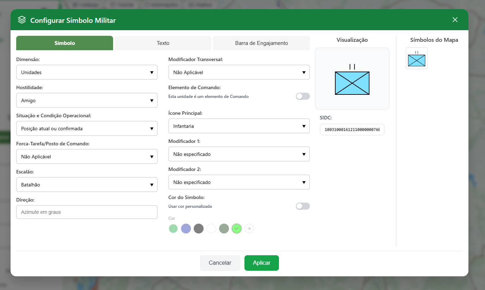

A ferramenta de Simbologia Militar cria símbolos no padrão SIDC 2.0 (App-6/2525). Clique no botão "Configurar Símbolo" para abrir o construtor, que oferece:

- Uma **galeria** ("Símbolos do Mapa") que reúne os símbolos já adicionados ao mapa, ordenados por frequência de uso, para reaproveitamento rápido.
- Abas para definir a **forma** (afiliação, conjunto de símbolos, ícone principal, modificadores e escalão), os **modificadores de texto** (designação, formação superior, quantidade, etc.) e a **barra de engajamento** (esta última disponível apenas para os conjuntos de símbolos que a aceitam).
- Entrada manual do código **SIDC** completo, com validação.
- Pré-visualização em tempo real e escolha de cor.

O símbolo aceita ainda ajuste de tamanho, rotação, opacidade e correção de zoom. Há suporte às extensões brasileiras de simbologia, entre elas o Terminal do SISCOMIS (Equipamentos e Viaturas, 209906) e o Militar genérico e o Civil genérico (Indivíduos Desembarcados, 110000 e 120000). Alguns rótulos seguem a grafia do MD33: "Mil" no Navio militar genérico, "RbAM" no Rebocador de Alto-mar e "Res" na Reserva de armamento.

<video src="./images/desenho_calunga.mp4" controls width="60%"></video>

##### Medida de Coordenação (Atalho "K")

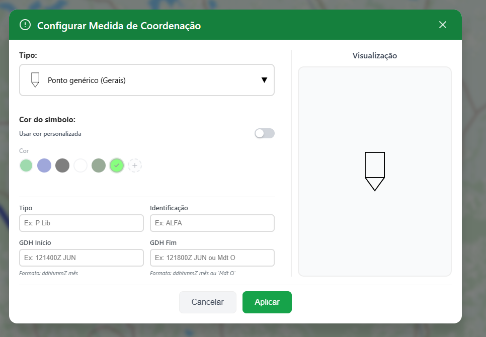

Medidas de coordenação são símbolos pontuais, compostos por um símbolo gráfico e amplificadores de texto. Cada símbolo é posicionado com um clique no mapa.

Ao clicar em "Configurar Símbolo", um catálogo com mais de cem pontos pré-definidos é apresentado, organizado em categorias: gerais, movimento e manobra, passagens (vau, ponte, portada, etc.), fogos, proteção (obstáculos, fortificações, minas, QBRN), logística (classes I a X), controle aéreo e controle marítimo. Para os pontos que aceitam, é possível definir o **escalão** e preencher **modificadores de texto** específicos (identificação, número, classe de suprimento, etc.).

Alguns pontos têm controles próprios:

- **Base de fogos (152000)**: a seta parte do meio da base e aponta para onde vão os fogos. No painel, o cursor "Direção dos fogos" vai de 0° a 359°, de grau em grau.
- **Setor de Tiro (140500)**: o vértice fica no ponto clicado, com a seta principal reforçada e a secundária tracejada. No painel, os cursores "Direção principal" e "Direção secundária" vão de 0° a 359°, e a linha "Abertura do setor" mostra o ângulo entre as duas. Mover a direção principal não arrasta a secundária, que continua apontando para o mesmo lugar do terreno.
- **Indicação pontual de campo minado (270701)**: no construtor, os campos "Posição 1", "Posição 2" e "Posição 3" escolhem o tipo de cada uma das três minas (Antipessoal, Anticarro, Qualquer tipo ou Vazia). A posição que não foi escolhida desenha a mina antipessoal.

A Base de fogos e o Setor de Tiro giram com o mapa: a direção é um azimute e fica alinhada ao terreno quando o mapa é rotacionado. Os demais pontos continuam em pé na tela e mantêm o cursor "Rotação". "Definir como padrão" não leva para a próxima medida os textos, as minas nem a direção secundária.

As destruições (planejada, preparada e realizada) nascem verdes, a cor dos obstáculos no MD33 (7.4.1), e a cor continua editável; as que já estavam desenhadas mantêm a cor com que foram gravadas. A Área minada (270800) saiu do catálogo de pontos e passou a ser um tipo da Área de Coordenação; as medidas pontuais de área minada já desenhadas continuam aparecendo como antes.

##### Seta (Atalho "S")

A Seta representa movimento ou manobra (eixos de progressão, direção de ataque, deslocamentos). Para desenhar, clique no ponto de origem, mova o cursor (a seta acompanha em pré-visualização) e finalize com o botão direito do mouse no destino; é possível clicar em pontos intermediários para um traçado de vários vértices. A largura é ajustada automaticamente ao zoom. Depois de criada, arraste os pontos brancos (manipuladores) para ajustar o traçado.

No painel é possível configurar:

- Cor de preenchimento e de borda, opacidade e espessura.
- Largura da seta e exibir/ocultar a ponta (a proporção da ponta é ajustada arrastando o manipulador da ponta).
- Modo **aeromóvel** (acrescenta o padrão cruzado no corpo da seta).

Setas podem ser **combinadas** em um único traçado: selecione duas ou mais setas compatíveis e use "Combinar Setas" no menu de contexto; o botão "Separar" desfaz a combinação.

<video src="./images/Seta.mp4" controls width="49%"></video>

##### Atração (atalho "G")

A atração permite ajustar automaticamente a posição de feições ao desenhar ou editar elementos no mapa, garantindo que vértices, segmentos ou pontos coincidam com outras feições existentes. Ao ativar a ferramenta, aproxime o cursor de uma feição compatível para que o encaixe seja realizado automaticamente. A atração é apenas um botão de liga/desliga (atalho "G"), sem painel de opções: ele captura sempre tanto vértices quanto segmentos, com tolerância e camadas de referência fixas. Esse recurso aumenta a precisão da edição e evita sobreposições, lacunas ou desalinhamentos entre feições.

##### Linha de Limite (Atalho "D")

A Linha de Limite demarca a separação entre unidades (por exemplo, o limite entre dois batalhões). Desenhe clicando em sucessivos vértices e finalize com o botão direito. Ao longo do traçado são desenhados, em intervalos, os **símbolos de escalão**:

- Algarismos romanos para os escalões maiores (XXXXXX = Teatro de Operações, XXXXX = Grupo de Exércitos, XXXX = Exército, XXX = Corpo de Exército, XX = Divisão, X = Brigada, III = Regimento, II = Batalhão, I = Companhia).
- Pontos para os menores (••• = Pelotão/Destacamento, •• = Seção, • = Esquadra).
- Ø = Equipe/Guarnição, um círculo vazado cortado por uma barra.
- ++ = Valor indeterminado, duas cruzes.

No painel é possível escolher o escalão, a cor, a espessura e a opacidade, e adicionar rótulos de texto acima e abaixo da linha.

Um limite pode ser cortado em dois. Com ele selecionado, escolha "Cortar Linha de Limite" no menu do clique direito (ou no menu da feição, no painel) e clique no ponto do corte; Esc cancela. Cada metade fica com os símbolos de escalão que caíam no seu trecho, e a metade que ficar sem nenhum ganha um símbolo no centro. As duas herdam o escalão, a cor, a espessura, a opacidade e os rótulos do limite original.

##### Linha de Coordenação (Atalho "Y")

A Linha de Coordenação desenha os símbolos lineares do MD33: uma polilinha com um glifo repetido a intervalos regulares, ou com textos nas pontas. Desenhe clicando em sucessivos vértices e finalize com o botão direito. No painel, o combobox "Símbolo" oferece catorze símbolos, agrupados em três blocos:

- **Obstáculos**: Linha de obstáculos (290100), Linha de barreiras (290199), Fosso anticarro (290202), Cerca de arame (290302), Cerca de arame dupla (290303), Concertina (290307), Concertina dupla (290308), Concertina tripla (290309), Sapa e Trincheira (290999) e Arame de tração (290500).
- **Manobra**: Linha de manobra genérica (140000) e Linha de Contato (140200).
- **Fogos**: Concentração de fogos em alvo linear (240701).

Os obstáculos nascem verdes, a cor do MD33 (7.4.1); manobra e fogos nascem pretos. Ao trocar de símbolo, a linha que ainda está na cor padrão passa para a cor padrão do novo símbolo, e a cor escolhida pelo operador nunca é trocada. As linhas de obstáculo desenhadas antes desta regra mantêm a cor com que foram gravadas.

Três símbolos têm campos próprios:

- **Linha de manobra genérica**: na seção Textos do painel, preencha Tipo, Identificação, GDH Início e GDH Fim. "Tipo Identificação" aparece acima da linha e os dois GDH abaixo, nas duas pontas.
- **Linha de Contato**: dois cordões de festões voltados um para o outro, com "Cor do lado amigo" e "Cor do lado inimigo" (vermelho por padrão). Cada cordão corre na sua paralela à linha, então nas dobras o lado de fora leva mais festões que o de dentro, e os dois seguem contínuos. O lado inimigo fica à esquerda do sentido em que a linha foi traçada, e "Inverter Linha", no menu da feição, troca os lados.
- **Concentração de fogos em alvo linear**: a linha com um traço transversal em cada ponta e o "Nº Concentração" acima do meio.

Para esses símbolos o painel também oferece "Tamanho do texto" e "Texto sempre para o norte".

Os cursores "Tamanho do símbolo" e "Distância entre símbolos" são medidos em metros no terreno, e a distância nunca fica menor que o dobro da largura do glifo, para que sobre linha entre eles. Nos símbolos sem glifo repetido (a linha de manobra e o alvo linear) e nos contínuos (fosso, sapa, trincheira e Linha de Contato) o cursor de distância some, e na linha de manobra some também o de tamanho. Uma linha muito longa vista de perto recebe no máximo 120 símbolos, e acima disso o espaçamento alarga sozinho, para o padrão seguir cobrindo a linha inteira em vez de parar no meio. A Correção de Zoom funciona como na Linha de Limite: ligada, o traço cresce com o zoom e os símbolos ficam presos ao terreno; desligada, o traço fica fixo na tela e os símbolos encolhem no terreno.

No menu da feição a linha pode ser continuada pelas pontas, invertida ("Inverter Linha", que troca o lado para onde o obstáculo aponta) e convertida em Linha, Seta ou Linha de Limite; o caminho inverso também existe. "Definir como padrão" não leva os textos para a próxima linha.

##### Área de Coordenação

A Área de Coordenação desenha as áreas do capítulo VII do MD33-C-01. Ela fica no grupo Militar, logo depois da Linha de Coordenação, e não tem atalho. O desenho é o do polígono comum: clique nos vértices e feche com o botão direito. O tipo escolhido decide a borda, a hachura e os textos. São sete tipos:

- **Área genérica (150000)**: o contorno simples, com o texto sobre a borda, dentro da área ou fora dela. Fora, o texto sai por uma linha de chamada perpendicular à borda, para o lado de fora, comprida o bastante para o bloco inteiro ficar fora da área.
- **Terreno restritivo (151100)**: hachura diagonal.
- **Terreno impeditivo (151199-01)**: hachura cruzada.
- **Ponto forte (151203)**: borda grossa com dentes voltados para fora, o nome no centro e o escalão numa caixa sobre a borda.
- **Zona fortificada (151000)**: a borda vira uma corrente de elos ovais.
- **Volume de aproximação de base (170999-01)**: contorno com portões. Com a área selecionada, "Marcar portão na borda" espera um clique no mapa e põe o portão no ponto da borda mais próximo: enquanto espera, o botão diz "Clique na borda da área" e o cursor fica em cruz, e Esc ou um novo toque no botão cancela. Cada portão tem nome (ALFA, BRAVO, e assim por diante, editável) e posição na borda, pode ser removido, e "Ocultar portões" esconde todos. O texto traz as altitudes máxima e mínima.
- **Área minada (270800)**: borda verde interrompida por um "M" ao norte, ao sul, a leste e a oeste, com três minas dentro. Os campos "Posição 1", "Posição 2" e "Posição 3" escolhem o tipo de cada uma (Antipessoal, Anticarro, Qualquer tipo ou Vazia).

O painel tem duas abas. Em **Símbolo** ficam o tipo, o "Tamanho do símbolo" (em metros, a medida dos dentes, elos, portões e minas), a "Correção de Zoom", a borda, o preenchimento e a hachura, e o escalão, os portões ou as minas quando o tipo os tem. A "Correção de Zoom" vale para a área inteira, desenho e textos juntos: ligada, tudo mantém o tamanho no terreno e cresce e diminui com o mapa, como numa carta impressa; desligada, tudo mantém o tamanho na tela. Com ela ligada, a hachura tem um limite na tela: ao afastar, quando as linhas ficariam juntas demais, ela passa a desenhar uma linha sim, outra não, em vez de fechar num bloco escuro. Em **Textos** ficam Tipo, Identificação, GDH Início, GDH Fim e Outras informações (com o botão "Preencher com área"), a posição do texto (sobre a borda, interna ou externa) e o tamanho do texto.

"Definir como padrão" leva para a próxima área o tipo e a aparência, mas não os textos, os portões nem o tamanho, que a área nova calcula pelo zoom em que é desenhada.

Um polígono pode virar Área de Coordenação, e a área pode voltar a ser polígono, pela linha "Converter" do menu "Opções" da feição, que abre os destinos ao lado ("Área de Coordenação" e "Polígono"). O contorno, as cores, a espessura, o estilo do traço, o preenchimento e a hachura atravessam a conversão. Do polígono para a área perde-se o rótulo da área; da área para o polígono perdem-se o tipo do MD33, os textos, os portões e as minas, e a mensagem de conclusão diz o que foi descartado.

A Área de Coordenação sai no PDF com toda a decoração. No KMZ ela vai com o contorno e o preenchimento, sem as decorações (dentes, elos, portões, minas e letras); os textos vão no nome e no balão da feição.

##### Frente Ocupada (Atalho "F")

A Frente Ocupada representa uma posição defensiva ocupada, no formato de dois braços em "V" que partem de um ponto central. Para criar, dê dois cliques: o ponto central e a ponta de um dos braços; o segundo braço é gerado automaticamente (ambos desenhados como curvas) e a frente é concluída logo após o segundo clique. No painel ajuste cor, espessura e opacidade. Os três pontos de base podem ser arrastados para reposicionar a frente.

##### Declinação Magnética (Atalho "W")

Insere um diagrama de nortes no mapa, com as setas do norte verdadeiro (NV), do norte de quadrícula (NQ) e do norte magnético (NM), além da declinação magnética (NV-NM) e da convergência meridiana (NV-NQ). O ângulo de declinação é calculado automaticamente (modelo WMM2025) na posição clicada e exibido apenas para consulta; no painel é possível ajustar o tamanho e a opacidade do diagrama. Útil como elemento de orientação em produtos cartográficos.

#### Azimute e Distância (Atalho "Z")

Funciona como uma caderneta de campanha digital. No painel, defina um ponto de referência (clicando no mapa ou digitando as coordenadas) e preencha uma tabela de pernas (azimute + distância). É possível escolher as unidades (graus ou milésimos; metros ou quilômetros) e o norte em que os azimutes são digitados, no seletor NM | NQ | NV: norte magnético (o da bússola), norte de quadrícula (o da quadrícula UTM da carta) ou norte verdadeiro (o geográfico). A declinação magnética é calculada automaticamente no ponto de referência pelo modelo WMM2025 e pode ser corrigida à mão; a convergência meridiana também é automática, calculada no fuso UTM do ponto, que o painel mostra ao lado do valor. Abaixo das pernas, uma linha lê a perna ativa nos três nortes (NV · NQ · NM), qualquer que seja o norte digitado. Por fim, escolha o modo de saída: **Rota** (gera uma linha ligando todas as pernas), **Ponto** (gera um ponto para o ponto de referência e para o fim de cada perna) ou **Área** (gera um polígono fechando de volta à origem, requer ao menos duas pernas). A feição gerada fica salva no mapa como linha, ponto ou polígono, e se edita como eles. A aba Azimutes de linhas e polígonos lê cada segmento nos três nortes, com a convergência e a declinação do primeiro vértice, e o botão "Editar azimutes e distâncias" reabre as pernas no painel: "Salvar alterações" reescreve a mesma feição, e "Cancelar" desiste.

#### Medição de Ângulo (Atalho "X")

Permite medir ângulos diretamente no mapa por meio de três cliques sucessivos (extremidade inicial, vértice e extremidade final). O resultado é exibido automaticamente, possibilitando a análise precisa da abertura entre duas direções ou segmentos. O resultado é exibido simultaneamente nas três unidades — graus, milésimos e grados —, facilitando sua utilização em diferentes contextos cartográficos, topográficos e militares.

#### Informação de vetor (Atalho "N")

Permite identificar feições do mapa base (EDGV). Ative a ferramenta e clique sobre um elemento do mapa para ver suas propriedades. Quando houver sobreposição, um menu permite escolher qual feição inspecionar.

#### Menu de contexto (clique direito)

Além de "Copiar coordenadas" e "Orientar para o norte", o clique direito oferece, conforme a seleção, várias ações:

- Criar grupo, combinar grupos e desagrupar feições.
- Combinar setas e separar setas.
- Cortar uma linha em duas: selecione a opção "Cortar Linha" e depois clique sobre a linha no ponto onde deseja cortá-la (Esc cancela). A Linha de Limite tem o mesmo corte, na opção "Cortar Linha de Limite".
- Ocultar (ou Mostrar) e Bloquear (ou Desbloquear) a seleção inteira, de uma feição ou de várias. O menu age sobre o que está selecionado; o clique direito sobre uma feição não a seleciona. Para mostrar ou desbloquear uma feição que já saiu da seleção, use o olho ou o cadeado da linha dela na aba de Camadas.
- Mover as feições para outra camada ou para outro mapa.
- Dar zoom para a seleção e duplicar a seleção.

Quem só pode ler o atlas, ou está num mapa bloqueado, não recebe os itens que editam (agrupar, combinar, cortar, mover, ocultar e bloquear).

##### Luminosidade neste ponto (dados solares e lunares)

O item "Luminosidade neste ponto", com o ícone de sol, abre um painel com as linhas de luz da matriz das condições meteorológicas do PITCIC (EB70-MC-10.336, Quadro 4-5) para o ponto clicado, em hora de Brasília (P, UTC−3), para o dia D e os dois seguintes:

- **ICMN** e **FCVN**: início do crepúsculo matutino náutico e fim do crepúsculo vespertino náutico, com o Sol a 12° abaixo do horizonte.
- **Fase lunar**: nova, crescente, cheia ou minguante, pela janela de sete dias centrada na fase principal (Fig 4-11), avaliada no meio da noite.
- **Ini Luar** e **Fim do luar**: o nascer e o ocaso da Lua que ilumina a noite de D. Horário que cai no dia seguinte leva "(+1)".

O dia D começa em hoje; as setas e o campo de data mudam o dia. Os blocos "Crepúsculos e claridade (Fig 4-10)" e "Cálculo auxiliar, fora do PITCIC" trazem os oito horários do Sol, da primeira à última claridade (Sol a −18°), e o percentual iluminado da Lua. Passe o mouse sobre um horário de crepúsculo para ler o que o manual diz dele.

"Salvar tabela" baixa a tabela em CSV, com o ponto, o fuso e a ressalva do horizonte. O cálculo usa o horizonte teórico ao nível do mar: relevo, nuvens e chuva não entram. Quando um fenômeno não acontece na data (em latitudes altas), a célula diz "não ocorre" ou "sem luar", com o motivo na dica. O cálculo é feito no próprio navegador, sem consultar a rede, e no celular o toque longo no mapa abre o mesmo item.

##### Meteorologia neste ponto (previsão do tempo)

O item "Meteorologia neste ponto", com o ícone de nuvem, aparece logo abaixo do de luminosidade (o administrador pode desligá-lo na aba Sistema). Ele abre um painel com as linhas de previsão da mesma matriz do PITCIC (Quadro 4-5) para o ponto clicado, para o dia D e os dois seguintes, em hora de Brasília:

- **Previsão de tempo**: a condição mais severa do dia (por exemplo, "Garoa fraca" ou "Trovoada").
- **Precipitação** e **Prob. de chuva**: o total previsto no dia e a maior probabilidade horária.
- **Temperatura máx.** e **mín.**, **Umidade máx.** e **mín.**
- **Ventos**: a direção predominante, como o manual escreve ("N-NW"), e a velocidade média em m/s; **Rajada máx.** mostra a hora ao passar o mouse.
- **Visibilidade mín.**: a menor do dia, com a hora na dica.
- **Visibilidade reduzida**: as horas do dia com visibilidade até 5 km, separadas pela causa, cada uma com o total de horas, a menor visibilidade e os horários (por exemplo, "Nevoeiro 3 h, mín. 180 m (04h a 06h)"). Nevoeiro é abaixo de 1 km e névoa de 1 a 5 km, nas horas sem chuva; com chuva ou garoa, a hora conta como "Precipitação". Sem nenhuma hora até 5 km, a célula diz "Sem restrição".

O bloco "Nebulosidade e pressão" traz as médias do dia. Embaixo da tabela ficam o modelo (GFS), a hora da rodada e o ponto consultado. Para proteger a área de interesse, o ponto é arredondado a cerca de 11 km antes de sair. "Salvar tabela" baixa o CSV. A previsão alcança até 14 dias à frente; para uma data mais distante, a coluna diz "sem previsão".

A consulta é feita pelo próprio navegador, direto na fonte da previsão. Sem acesso a ela, o painel mostra "Previsão indisponível" e o botão "Tentar de novo". Os dois painéis ocupam o mesmo lugar na tela, então abrir um fecha o outro.

### Módulo 5: Painel Auxiliar Direito

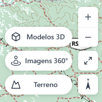

- Compartilhar esta vista (acima do +): copia um link com o mapa base e a câmera atuais; quem abre o link chega à mesma vista.
- +: aumenta o zoom no mapa, também pode ser feito com o scroll do mouse.
- -: reduz o zoom no mapa, também pode ser feito com o scroll do mouse.
- Habilitar tela cheia
- Orientar para o norte: reseta a orientação do mapa para o norte, sem inclinação.
- Modelos 3D: habilita no mapa os marcadores 3D, que ao serem clicados abrem um preview e a possibilidade de visualizar o 3D.

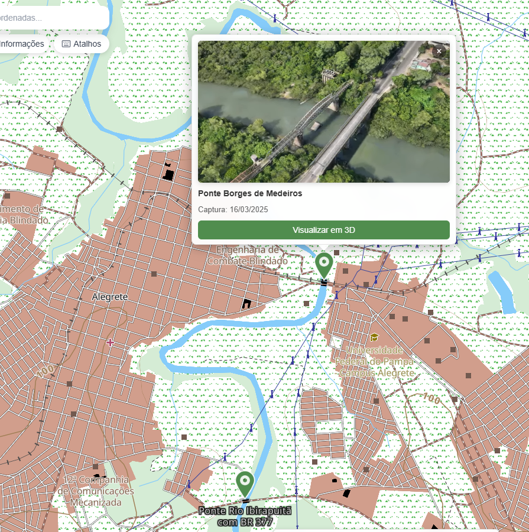

- Imagens 360°: habilita no mapa os marcadores de onde há imagens em 360°.
- Terreno: desenha o relevo em 3D e, em um pequeno nível, afeta a performance da aplicação. As ferramentas de análise e a elevação do painel de coordenadas não precisam dele ligado.
- Horizonte (a metade pequena ao lado do Terreno): mostra o horizonte visto de um ponto, como numa foto panorâmica do relevo. Clique no botão e depois no mapa; a vista abre em tela cheia naquele ponto, com a tela de carregamento do EBGeo até o relevo de 100 km chegar (na rede lenta isso pode levar um minuto, e o "×" no canto cancela). Arraste para os lados para girar os 360°; o rumo aparece no meio da régua do topo. Os controles ficam numa barra só, embaixo: a altura do olho sobre o terreno (mínimo 1,5 m, padrão 2 m; a altitude do olho aparece ao parar o mouse sobre ela), o exagero vertical (de 1× a 5×, que estica o relevo sem mudar quem esconde quem), a data (clique nela para abrir o calendário) e a régua da hora, no horário de Brasília. O arco do Sol mostra o caminho do dia sobre o relevo, e ao lado do ícone do Sol ficam o nascer e o pôr reais, já contando as montanhas; o ícone vira a vista para o Sol. Ao passar o mouse sobre o relevo, o ponto que você está vendo aparece no mini-mapa do canto, que também mostra para onde você está olhando e pode ser recolhido. O botão direito sobre o relevo abre "Mover", que leva a vista voando num arco até aquele ponto e carrega o relevo de lá, e "Copiar coordenadas", que copia a coordenada daquele ponto do chão no formato escolhido no painel de coordenadas do mapa. Quando o administrador configura uma imagem, o botão "Imagem sobre o relevo" pinta o chão com ela até 15 km. O "×" no canto ou o Esc voltam ao mapa. A vista precisa de placa de vídeo; sem ela, fica lenta e avisa.

#### Ferramentas de análise

A Linha de Visada, a Análise de Visibilidade e a Cobertura de Radar leem o relevo do atlas por conta própria, com o Terreno ligado ou desligado. Elas só ficam indisponíveis quando o atlas não tem terreno, e a dica do botão diz o motivo. Se o relevo do atlas não puder ser lido sem o desenho 3D, a ferramenta pede para ligar o Terreno.

##### Linha de Visada — LOS (Atalho "O")

Avalia se há visada entre dois pontos considerando o relevo. Clique no ponto do observador e depois no ponto do alvo. O trecho **visível** é mostrado em verde e o **obstruído** em vermelho. No painel é possível ajustar a altura do observador e do alvo, a quantidade de pontos de amostragem e visualizar o perfil de elevação. Mover qualquer extremidade recalcula a visada automaticamente.

<video src="./images/LOS_cliques.mp4" controls width="60%"></video>

##### Visibilidade — Viewshed (Atalho "V")

Calcula, a partir de um observador, qual a área visível dentro de um setor. Clique para posicionar o observador e clique novamente para definir o raio e a direção. Uma barra de progresso indica o cálculo. As áreas visíveis aparecem em verde e as bloqueadas em vermelho. No painel ajuste o raio, a abertura do setor e as alturas do observador e do alvo; os manipuladores permitem mudar o raio (alça vermelha) e a abertura (alça azul).

<video src="./images/Viewshed_cliques.mp4" controls width="60%"></video>

**Perfil da visibilidade.** Com uma análise selecionada, ligue "Mostrar perfil" na aba Estilo. Uma faixa abre embaixo do mapa com o setor visto do observador, em fatias de terreno empilhadas: o eixo de baixo é o azimute e o da esquerda é o ângulo de elevação. O que aparece na faixa é o que o observador enxerga, pela mesma regra das áreas verdes e vermelhas do mapa. Ao passar o cursor na faixa, a dica mostra azimute, distância e cota, e o ponto é marcado no mapa. Na própria faixa escolha o estilo (Atmosférico ou Clássico) e o exagero vertical; essas escolhas ficam guardadas neste navegador. As áreas sem visada se leem no mapa, em vermelho: na faixa, o que aparece é o que o observador vê. O botão de download salva a imagem em PNG, e o × fecha a faixa.

#### Ferramentas de medição (efêmeras)

São medições rápidas que não ficam salvas no mapa — mas podem ser convertidas em feição pelo botão "Salvar como feição".

- **Distância (Atalho "J")**: clique para marcar pontos sucessivos; o botão direito finaliza. Mostra a distância de cada trecho e o total. Unidades: metros, quilômetros, milhas náuticas ou pés.
- **Área (Atalho "H")**: desenhe um polígono; mostra a área e o perímetro. Unidades: m², hectares ou km².

<video src="./images/Distance_cliques.mp4" controls width="49%"></video>
<video src="./images/Area_cliques.mp4" controls width="49%"></video>

### Módulo 6: Painel Inferior de Coordenadas

Na parte inferior da tela, o EBGeo exibe em tempo real as coordenadas do ponto sob o cursor, o nível de zoom atual e, quando o atlas tem terreno, a elevação do ponto, com o Terreno ligado ou desligado. Ligar o Terreno não muda o número: o exagero vertical do desenho 3D não entra na elevação.

O ícone de engrenagem permite alternar o **formato das coordenadas**:

- Lat/Long em graus decimais (ex.: `-22.45592°, -44.44966°`).
- Lat/Long em GMS — graus, minutos e segundos (com a convenção brasileira L/O para Leste/Oeste).
- UTM (WGS84).
- MGRS.

#### Grade

A partir do mesmo painel é possível ativar uma **grade** sobreposta ao mapa, nos formatos **Lat/Long** ou **UTM**, em escalas de 250k, 100k, 50k e 25k (exibida a partir de um zoom mínimo). O estado da grade é salvo por mapa. Para desligar, selecione a opção "Desligar".

### Módulo 7: Uso do Streetview (Imagens 360°)

Ative "Imagens 360°" no painel auxiliar direito para exibir os marcadores das fotos panorâmicas. Clique em um marcador para ver o preview e entrar na visualização 360°.

<video src="./images/StreetView.mp4" controls width="60%"></video>

#### Navegação dentro da cena

- **Mouse**: clique e arraste para girar a vista.
- **Teclado**: setas ou W/A/S/D para olhar ao redor; +/− para aproximar/afastar (zoom/FOV).
- Os marcadores brancos próximos representam outras fotos: clique para "andar" até elas.
- Um **mini-mapa** sincronizado mostra sua posição e permite navegar clicando nele.

#### Marcadores e ferramentas na cena

É possível adicionar marcadores (pontos de interesse) dentro da imagem 360°. Cada marcador tem nome, descrição, estilo (cor, tamanho, etiqueta) e fotos associadas. A orientação da câmera pode ser salva pelo botão "Salvar orientação" (ou tecla O) e é restaurada ao retornar à mesma foto. Há também um botão para capturar uma imagem (screenshot) da cena em Exportar Imagem.

### Módulo 8: Uso de Ferramentas no Mapeamento 3D

Ative "Modelos 3D" no painel auxiliar direito para exibir os marcadores dos modelos. Clique em um marcador para ver o preview e abrir a visualização 3D (Cesium) em tela cheia.

Navegue com o mouse (arrastar para girar/deslocar, roda para zoom, botão direito para inclinar) e com o teclado. A barra de ferramentas do visualizador 3D oferece:

- **Marcador 3D**: clique sobre a superfície do modelo para criar um ponto de anotação. Edite nome, descrição, localização (em vários formatos), estilo do marcador e da etiqueta, e fotos.
- **Medição 3D**: meça **distância** ou **área** sobre o modelo, com resultado e estilo configuráveis.
- **Viewshed 3D**: defina um observador e um cone de visão (campo horizontal, distância e altura do observador) para visualizar as áreas visíveis e bloqueadas.
- **Salvar câmera**: guarda a posição atual da câmera para restaurá-la depois.
- **Screenshot**: captura a cena 3D como imagem.

Os marcadores, medições e viewsheds criados no 3D também aparecem no mapa 2D, mantendo os dois ambientes sincronizados.

### Módulo 9: Briefings (Apresentações)

O Briefing permite montar apresentações navegáveis (story maps) combinando mapa 2D, modelos 3D e imagens 360°.

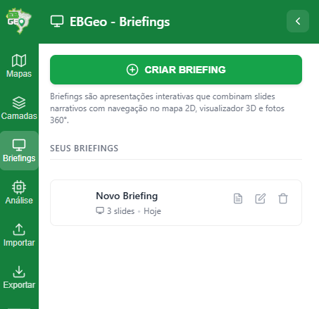

#### Criar e editar

Na aba **Briefings** do painel lateral esquerdo, crie um novo briefing. No editor:

- Adicione slides; ao criar um slide, a **posição atual** é capturada automaticamente (enquadramento do mapa 2D, câmera 3D ou orientação 360°, conforme o que estiver ativo).
- Abaixo de **Salvar Posição**, escolha o **mapa base do slide** e se o **controle temporal** fica ligado nele. Salvar Posição preenche os dois com o que está na sua tela e guarda também o **instante da linha do tempo** em que você estava, nos três tipos de slide (2D, 3D e 360°). Ao apresentar, o slide repõe aquele instante, de modo que cada slide mostra a situação na hora que lhe corresponde, sem que o apresentador precise mover a régua. Um slide salvo com o controle temporal desligado não guarda instante nenhum e não mexe na linha do tempo. A opção "O do mapa" faz o slide usar o mapa base salvo com o mapa. Ao sair da apresentação, o mapa base e o controle temporal voltam ao que você tinha antes.
- Escreva o texto de cada slide em um editor de texto formatado.
- Abaixo do conteúdo, em **Controles visíveis na apresentação**, marque o que o público pode ver e usar naquele slide: seletor de mapa base, modelos 3D, imagens 360, terreno, controle de coordenadas, utilitários, busca, controles de navegação (zoom, tela cheia e bússola, numa caixa só) e a barra temporal. Todos começam desmarcados, ou seja, a apresentação mostra só o mapa e o texto. **A barra da linha do tempo, em particular, não aparece na apresentação a menos que você a marque aqui**, mesmo nos slides que repõem um instante: o instante é reposto de qualquer forma, e a barra só entra quando você quer que o público possa mover a régua. Mesmo marcada, a engrenagem de configurações temporais continua escondida enquanto se apresenta. O botão de entrar, a área do usuário, o nome do atlas, o indicador de sincronia, a lista de usuários online e o botão de compartilhar a vista nunca aparecem durante a apresentação.
- Reordene os slides arrastando, renomeie ou exclua.
- Importe a nota do mapa para o conteúdo do slide atual, ou importe slides de outro briefing.

Enquanto o editor de briefing está aberto, o mapa fica só para leitura. Apagar, desenhar ou desfazer pelo teclado não altera nada e mostra o aviso "Feche o editor de briefing para editar o mapa.". Feche o editor para voltar a editar.

#### Apresentar

No modo de apresentação, o briefing ocupa a tela inteira e troca automaticamente entre os ambientes (2D, 3D, 360°) a cada slide, exibindo o texto correspondente. Atalhos:

| Tecla | Ação |
| --- | --- |
| → ou D | Próximo slide |
| ← ou A | Slide anterior |
| Home / End | Primeiro / último slide |
| F | Alternar tela cheia |
| Esc | Sair da apresentação |

Um briefing também pode ser exportado como PDF (uma página por slide).

### Módulo 10: Processamento e Recursos Avançados

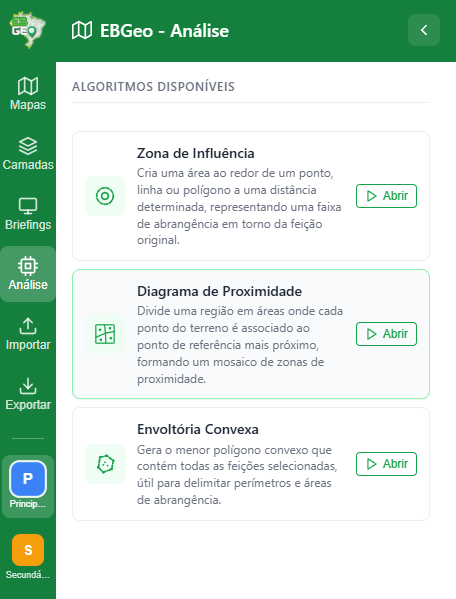

#### Processamento geoespacial

O EBGeo inclui algoritmos de análise que recebem as feições selecionadas (ou de uma camada) e geram um novo polígono de resultado:

- **Zona de Influência**: cria uma área ao redor de um ponto, linha ou polígono a uma distância determinada (em metros), representando uma faixa de abrangência em torno da feição original.
- **Zonas de Proximidade**: divide uma região em áreas onde cada ponto do terreno fica associado ao ponto de referência mais próximo, formando um mosaico de zonas de proximidade.
- **Contorno Externo**: cria a menor área que envolve todas as feições selecionadas, como um elástico esticado em volta dos pontos. Útil para delimitar perímetros e áreas de abrangência.
- **Pontos Dominantes**: não usa camada de origem. Desenhe um polígono no mapa (o botão direito marca o último vértice e fecha) e receba, numa camada de pontos, os topos de morro de dentro dele que sobem pelo menos o destaque mínimo acima do terreno em volta, do mais alto ao mais baixo.

Na área de recorte das Zonas de Proximidade, o segundo canto do retângulo também se marca com o botão direito.

### Módulo 11: Linha do Tempo (Controle Temporal)

O EBGeo permite dar uma dimensão temporal ao mapa: cada feição pode ter uma **validade no tempo** (quando aparece e desaparece) e feições móveis (pontos, símbolos militares e medidas de coordenação) podem ter uma **trajetória** que as desloca ao longo do tempo. É ideal para representar a evolução de uma operação hora a hora ou dia a dia.

#### Ativar o controle temporal

No card do mapa atual (aba **Mapas**), clique no botão de **relógio** para ativar o controle temporal daquele mapa. Uma **barra de linha do tempo** aparece na parte inferior da tela. Ligar e desligar vale só para a sua tela, assim como reproduzir, pausar, a velocidade e mostrar feições ocultas; as configurações da engrenagem (janela, unidade e modo) são do mapa e valem para todos. Para que o mapa abra com o controle temporal ligado para quem chega, ligue-o e use **Salvar Posição**.

<video src="./images/Controle_Temporal.mp4" controls width="60%"></video>

#### A barra de linha do tempo

- **Reproduzir/Pausar**: anima o cursor ao longo do intervalo, mostrando feições e trajetórias evoluindo no tempo.
- **Velocidade**: seletor da velocidade de reprodução.
- **Cursor (régua)**: arraste para navegar até um instante específico. Clicar na régua também lhe dá o foco do teclado, e então: as setas ← → (ou ↑ ↓) avançam e retrocedem um passo, que é a unidade configurada; **Page Up** e **Page Down** saltam dez passos; **Home** e **End** vão direto ao início e ao fim do intervalo. A régua exibe o instante atual.
- **Olho (modo revelar)**: mostra temporariamente as feições que estariam ocultas fora do intervalo atual — útil durante a edição, sem precisar mover o cursor.
- **Engrenagem (configurações)**: abre as configurações temporais do mapa.

Cada usuário navega sua própria linha do tempo: reproduzir, pausar, mover o cursor e mostrar feições ocultas são ações locais, não afetam os demais e não aparecem para ninguém. A lista de usuários online diz quem está no mapa, nunca em que instante cada um está.

Um slide de briefing é a exceção deliberada a isso: ele guarda o instante em que foi salvo e o repõe ao ser apresentado, para todos que assistem. Veja o Módulo 9.

#### Configurações temporais

A engrenagem da barra abre as configurações do mapa. **A tela não é a mesma nos dois modos**: dois campos aparecem sempre, dois trocam de rótulo e de unidade, e dois só existem no modo Relativo.

Sempre presentes:

- **Modo**: **Absoluto** (datas e horas reais) ou **Relativo** (offsets militares D+N a partir de uma origem).
- **Unidade de divisão**: minuto, hora, dia ou semana (granularidade da régua e do passo do cursor).

No modo **Absoluto**, os limites do intervalo aparecem como:

- **Início do mapa** e **Fim do mapa**, preenchidos com data e hora reais. Em branco, são deduzidos automaticamente das feições.

No modo **Relativo**, os mesmos dois limites aparecem como **Início** e **Fim** em offsets da unidade (por exemplo, Fim igual a 300 para D+300), e surgem mais dois campos que não existem no modo absoluto:

- **Data de D (origem)**: a referência para o eixo D+N. Ela apenas **rotula** a régua e não move as feições.
- **Reagendar feições**: ação explícita que **desloca todas as feições e trajetórias no tempo** para que o Dia D caia em outra data real, mantendo os offsets D+N. Use ao reprogramar a operação. Ela pede confirmação e não pode ser desfeita.

Trocar de modo não mexe nos limites: o intervalo é o mesmo nos dois, só muda como ele é escrito na tela.

Duas recusas valem nos dois modos. O fim precisa ser posterior ao início: uma janela invertida é recusada com um aviso e o cursor volta ao campo que a causou, em vez de a janela ser corrigida por conta própria. E, com o mapa travado, salvar é recusado: a tela continua aberta com o que você digitou e o aviso nomeia a trava.

#### Validade temporal das feições

No painel de qualquer feição há a seção **Validade temporal**, com os campos **Início** e **Fim**. A feição só fica visível enquanto o cursor estiver dentro dessa janela. Campos em branco significam **permanente** (visível em qualquer instante). Os valores podem ser informados como data/hora exata ou como offset (D+N), conforme o modo.

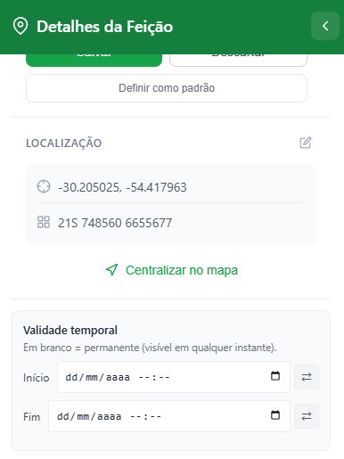

#### Trajetórias (feições móveis)

Pontos, símbolos militares e medidas de coordenação podem receber uma **Trajetória** — uma sequência de pontos-chave, cada um com um instante associado. Durante a reprodução, a feição se move suavemente interpolando entre eles.

A trajetória é editada no mapa, de forma análoga à ferramenta de linha:

- **Adicionar no mapa**: entra no modo de adição — cada clique acrescenta um ponto-chave ao final da trajetória, um passo de tempo após o ponto-chave anterior (estendendo o caminho para a frente no tempo). Uma barra de "Cancelar / Concluir" aparece no topo.
- **Mover** um ponto-chave: arraste o manipulador (mantém o instante daquele ponto).
- **Inserir**: clique no manipulador intermediário de um segmento (o instante é a média dos vizinhos).
- **Remover**: botão direito sobre um ponto-chave.

O painel da feição mostra estatísticas da trajetória (número de pontos, duração e distância) e permite saltar o cursor para cada ponto-chave.

#### Atributos automáticos (Simbologia Militar e Medida de Coordenação)

Símbolos militares e medidas de coordenação com trajetória podem ter atributos **derivados automaticamente** do movimento, por meio dos "Vínculos automáticos" no painel:

- **Direção**: a direção de deslocamento, calculada a partir da trajetória no instante atual.
- **Velocidade**: a velocidade do trecho atual.
- **GDH/DTG**: o grupo data-hora, derivado da janela de validade temporal.

Esses vínculos são opcionais (desligados por padrão) e atualizam o símbolo conforme a reprodução avança. A **rotação** do símbolo permanece sempre manual.
